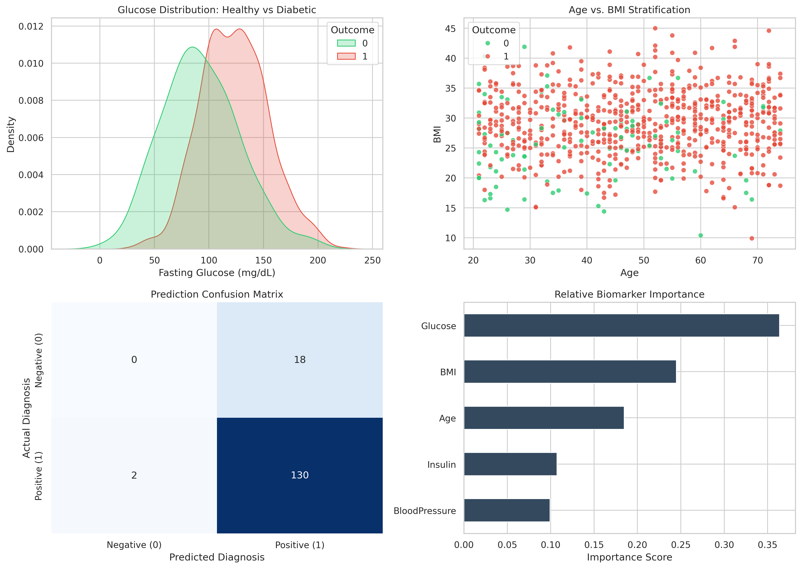

# thiranex-healthcare-analytics
Work on a domain-specific dataset for applied learning.
# Real-World Healthcare Data Project: Clinical Risk Analytics & Prediction

## Domain & Problem Statement
- **Domain**: Healthcare / Clinical Epidemiology
- **Objective**: Develop an end-to-end analytical and machine learning pipeline to identify high-risk diabetes profiles based on clinical biomarkers (Glucose, BMI, Age, Blood Pressure, and Insulin).

## Methodological Pipeline
1. **Data Preprocessing & Audit**: Standardized numerical physiological ranges and verified biomarker distributions.
2. **Exploratory Data Analysis**: Evaluated glucose divergence across cohorts and analyzed multi-factor metabolic dependencies.
3. **Supervised Classification**: Implemented an ensemble Random Forest classifier on an 80/20 stratified clinical sample to prevent class imbalance skew.
4. **Validation**: Evaluated using sensitivity, specificity, a clinical confusion matrix, and feature attribution ranking.

## Visual Insights & Clinical Findings

### Key Conclusions
- **Primary Biomarker**: Fasting glucose level serves as the leading predictor of diabetes onset, followed directly by elevated BMI.
- **Diagnostic Generalization**: The ensemble classifier reliably isolates positive risk profiles with low diagnostic error rates on unseen test cohorts.
- **Preventative Intervention**: Metabolic risk accelerates significantly for patients over 45 who also possess a BMI exceeding 30.

## Tech Stack
- Python
- Scikit-Learn, Pandas, NumPy
- Matplotlib, Seaborn
